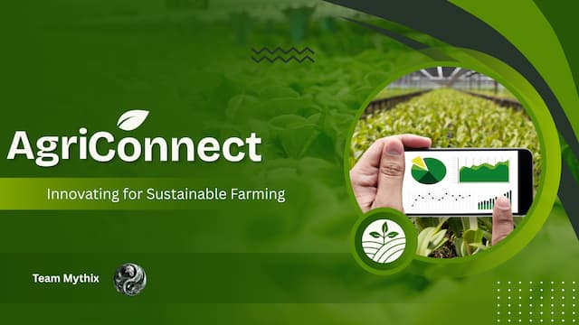

# 🌱 AgriConnect


## **Innovating for Sustainable Farming** ##

AgriConnect is a digital platform designed to connect farmers with agricultural officers, provide data-driven insights, and improve decision-making in the agricultural sector. The system aims to enhance productivity, transparency, and accessibility through modern web technologies. It is primarily focused on increasing crop production in Sri Lanka by introducing a point-based system that rewards farmers based on their harvest performance, along with an early disease detection and reporting system to reduce crop losses and improve agricultural efficiency.

---

<p align="center">
  
</p>

## 🚀 Features

- 👨‍🌾 Farmer Registration & Management  
- 🧑‍💼 Agricultural Officer Dashboard  
- 📊 Yield Analysis & Point Calculation System
- 🤖 AI Plant Disease Identifier
- 🚨 Early Reporting System  
- 🌐 Centralized Data Management  
- 📱 Responsive Web Interface  
- ☁️ Cloud Deployment 
---

## 🧠 Core Functionality

- Farmers can receive points based on their harvest and track performance.  
- Agricultural officers can monitor farmer activities and provide recommendations.  
- System calculates performance points based on yield comparisons.  
- Data visualization helps identify trends and improve productivity.
- Farmers can report issues quickly and easily through the platform, enabling timely support and intervention.  

---

## 🏗️ Tech Stack

### Frontend
- React  
- HTML, Tailwind CSS, JavaScript, TypeScript 

### Backend
- Express.js  

### Database
- MongoDB  

### Deployment
- Frontend - Vercel
- Backend - Render  


<p align="center">

<a href="https://reactjs.org/">
  
</a>

<a href="https://www.w3.org/html/">
  
</a>

<a href="https://tailwindcss.com/">
  
</a>

<a href="https://developer.mozilla.org/en-US/docs/Web/JavaScript">
  
</a>

<a href="https://www.typescriptlang.org/">
  
</a>

<a href="https://nodejs.org">
  
</a>

<a href="https://expressjs.com">
  
</a>

<a href="https://vercel.com">
  
</a>

<a href="https://render.com">
  
</a>

</p>

---

## 📦 Installation

```bash
# Clone the repository
git clone https://github.com/cepdnaclk/e22-co2060-Crop-Yield-Optimization-and-Intelligent-Plant-Disease-Analysis.git

# Navigate into the project
cd code/backend

# Install dependencies
npm install

# Run the development server
npm start

# Go back to project root
cd ..

# Navigate into the frontend project
cd frontend

# Install dependencies
npm install

# Run the development server
npm run dev

```
---

## Team Mythix

- S.H.S. Hansara – Product Owner – e22130@eng.pdn.ac.lk  
- T.H. Abeywickrama – Team Leader – e22008@eng.pdn.ac.lk  
- Gunawardhana H.P.J. – Project Collaborator – e22126@eng.pdn.ac.lk  
- Hatharasinghe H.T.D. – Project Collaborator – e22135@eng.pdn.ac.lk  
